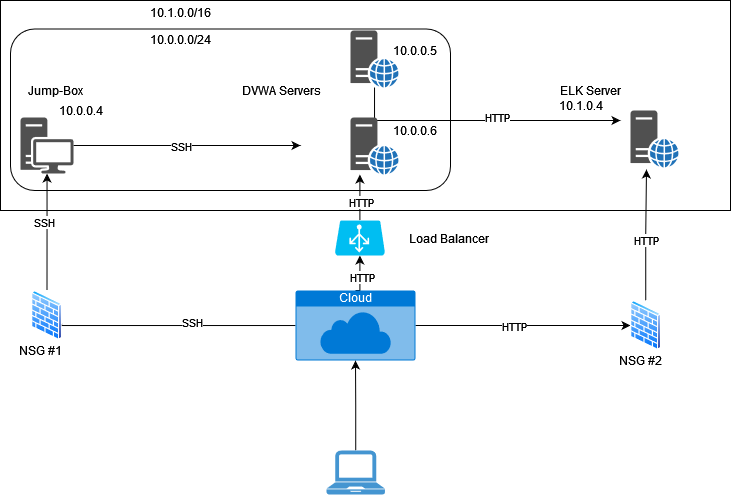

## Automated ELK Stack Deployment

The files in this repository were used to configure the network depicted below.

These files have been tested and used to generate a live ELK deployment on Azure. They can be used to either recreate the entire deployment pictured above. Alternatively, select portions of the playbooks file may be used to install only certain pieces of it, such as Filebeat.

  -ansible_config.yml

This document contains the following details:
- Description of the Topology
- Access Policies
- ELK Configuration
  - Beats in Use
  - Machines Being Monitored
- How to Use the Ansible Build

### Description of the Topology

The main purpose of this network is to expose a load-balanced and monitored instance of DVWA, the D*mn Vulnerable Web Application.

Load balancing ensures that the application will be highly redundant, in addition to restricting unauthorized access to the network.
- What aspect of security do load balancers protect?: balancing the traffic load. What is the advantage of a jump box?: Secure access point for all to connect through before accessing trusted virtual cloud.

Integrating an ELK server allows users to easily monitor the vulnerable VMs for changes to the data and system logs.
- What does Filebeat watch for? Monitors the log files and locations, then forwards for indexing.
- What does Metricbeat record? Collect metrics and statistics and fowards them to the ouput of your choice.

The configuration details of each machine may be found below.
_Note: Use the [Markdown Table Generator](http://www.tablesgenerator.com/markdown_tables) to add/remove values from the table_.

| Name          | Function     | IP Address                 | Operating System |
|---------------|--------------|----------------------------|------------------|
| Jump Box      | Gateway      | 40.71.127.221 /  10.0.0.4  | Linux            |
| Web-1         | DVWA         | 20.106.130.226 / 10.0.0.5  | Linux            |
| Web-2         | DVWA         | 20.106.130.226 / 10.0.0.6  | Linux            |
| Load Balancer | Availability |     20.106.130.226         | Linux            |
| ELK-SERVER    | ELK STACK    | 70.83.141.220 / 10.1.0.4   | Linux            |

### Access Policies

The machines on the internal network are not exposed to the public Internet. 

Only the jumpbox machine can accept connections from the Internet. Access to this machine is only allowed from the following IP addresses:
- 10.0.0.4

Machines within the network can only be accessed by jump box .
- Jump Box 10.0.0.4

A summary of the access policies in place can be found in the table below.

| Name          | Publicly Accessible     | Allowed IP Addresses |
|---------------|-------------------------|----------------------|
| Jump Box      | Yes                     | x.x.x.x              |
| Web-1         | Yes (via Load Balancer) | x.x.x.x / 10.0.0.4   |
| Web-2         | Yes (via Load Balancer) | x.x.x.x / 10.0.0.4   |
| ELK-SERVER    | Yes                     | x.x.x.x / 10.0.0.4   |
 
### Elk Configuration

Ansible was used to automate configuration of the ELK machine. No configuration was performed manually, which is advantageous because...
- Easy to set up and use.
- Flexible but powerful.
- Agentless: No need to install any other software or firewall ports.
- Efficency: More room for application resources on the server.

The playbook implements the following tasks:
- ... Install Docker
- ... Install pip3
- ... Instal Docker python 
- ... Increase Virtual Memory
- ... Download and launch a docker

The following screenshot displays the result of running `docker ps` after successfully configuring the ELK instance.

### Target Machines & Beats
This ELK server is configured to monitor the following machines:
- Web 1 
- Web 2

We have installed the following Beats on these machines:
- Filebeat
- Metricbeat

These Beats allow us to collect the following information from each machine:
- Filebeat: Collect data and file system
- Metricbeat: Collect machine metrics and statistics

### Using the Playbook
In order to use the playbook, you will need to have an Ansible control node already configured. Assuming you have such a control node provisioned: 

SSH into the control node and follow the steps below:
- Copy the playbook file to the target machine.
- Update the post file to include IP address of the target machine
- Run the playbook, and navigate to /etc/ansible to check that the installation worked as expected.

- This file that is the playbook is ansible-playbook. It is copied to install_elk.yml.
- To make Ansible run the playbook on a specific machine you just need to update the hosts file. 
- Filebeat & Metricbeat should be installed on the machines one wished to monitor while the ELK server should be installed 
  on a designated server with enough hardware capability to support the monitoring of Filebeat & MetricBeat
- To check that the ELK server is running navigate to: http://[public_ip_of_elk_server]:5601
- 
_Commands the user will need to run to download the playbook, update the files, etc._
ansible-playbook (name_of_playbook)
